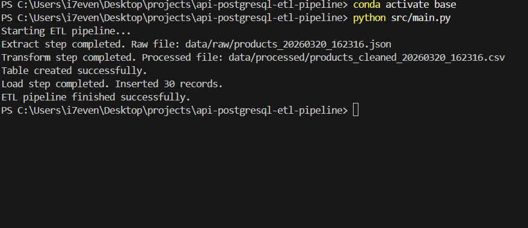
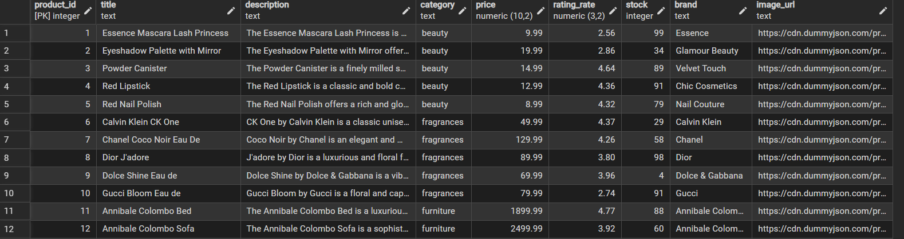
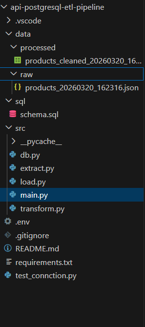

# API to PostgreSQL ETL Pipeline

## Project Overview
This project demonstrates a simple ETL pipeline that extracts product data from a public API, transforms and cleans it using Python and Pandas, and loads the final dataset into a PostgreSQL database.

The project was built as a beginner-friendly data engineering portfolio project to demonstrate core ETL concepts such as API extraction, data transformation, and relational database loading.

---

## Screenshots

### Pipeline Execution


### PostgreSQL Table


### Project Structure


---

## Architecture
```text
Public API → Extract (Python Requests) → Transform (Pandas) → Load (PostgreSQL)
```
---

## Tech Stack
- Python
- Requests
- Pandas
- PostgreSQL
- psycopg2
- python-dotenv

---

## Key Features
- Extracts product data from a public API
- Cleans and transforms data using Pandas
- Loads data into PostgreSQL
- Saves raw and processed data locally
- Prevents duplicate inserts using PostgreSQL conflict handling

---

## Pipeline Flow
1. Extract product data from API
2. Save raw JSON data locally
3. Transform and clean the dataset using Pandas
4. Save processed data as CSV
5. Create the target PostgreSQL table
6. Load clean data into PostgreSQL

---

## Project Structure
```
api-postgresql-etl-pipeline/
│
├── data/
│   ├── raw/
│   └── processed/
│
├── sql/
│   └── schema.sql
│
├── src/
│   ├── extract.py
│   ├── transform.py
│   ├── load.py
│   ├── db.py
│   └── main.py
│
├── assets/
├── .env.example
├── .gitignore
├── requirements.txt
└── README.md
```

---

## How to Run

1. Clone the repository
2. Create and activate a virtual environment

```
pip install -r requirements.txt
```

3. Create a `.env` file using `.env.example`
4. Update database credentials

5. Run the pipeline:

```
python src/main.py
```

---

## Output
The pipeline creates a `products` table in PostgreSQL and loads the cleaned product data into it.

It also saves:
- raw API response as JSON
- cleaned dataset as CSV

---
## Sample Output

### loaded Products Table


---

## Deduplication
The pipeline prevents duplicate inserts by using a primary key on `product_id` and PostgreSQL conflict handling with `ON CONFLICT DO NOTHING`.

---

## Example Use Case
This project simulates a real-world data engineering workflow where product data is extracted from an external API and prepared for downstream analytics or reporting.

---

## Future Improvements
- Add logging
- Add data quality checks
- Add incremental loading
- Add orchestration with Apache Airflow
